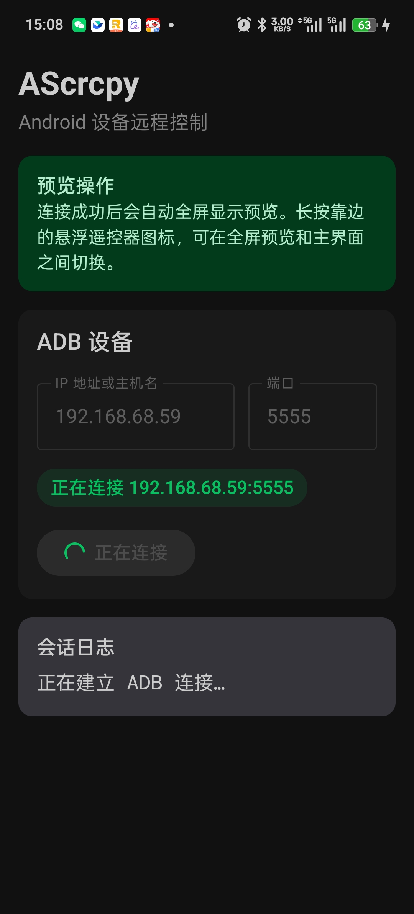
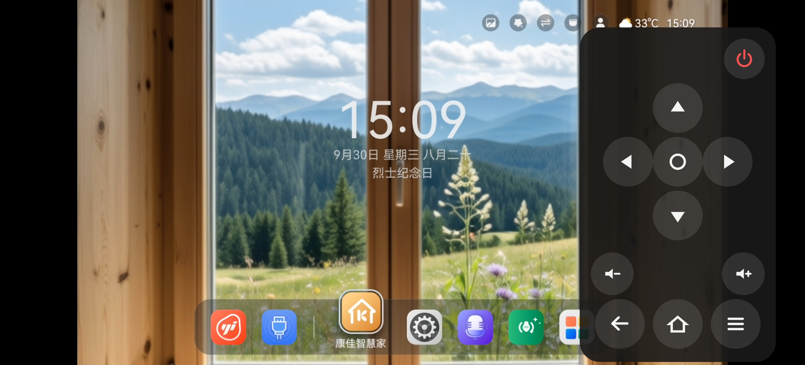

# AScrcpy

[](LICENSE)
[](https://kotlinlang.org)
[](https://developer.android.com/jetpack/compose)

[English](README.md) | [简体中文](README.zh-CN.md)

Mirror and control one Android device from another Android device. AScrcpy puts a full scrcpy
controller on an Android phone or tablet: no PC, no root, nothing installed on the target.

It connects straight to the target's `adbd`, pushes a matching scrcpy server, decodes the H.264
stream with `MediaCodec`, and turns touches and key presses into scrcpy control messages. The whole
controller UI is Jetpack Compose.

---

## Acknowledgements — this project stands on scrcpy

**AScrcpy exists because of [scrcpy](https://github.com/Genymobile/scrcpy).**

Romain Vimont (`@rom1v`) and the scrcpy contributors designed and built the protocol, the device
server, and the whole idea of "mirror an Android device with nothing installed on it". AScrcpy
reuses that work directly:

- the bundled `app/src/main/assets/scrcpy-server-v4.0` is the **unmodified scrcpy 4.0 server**,
  byte-identical to the official artifact;
- the controller speaks the **scrcpy wire protocol**, pinned to a matched client/server version.

Everything else - the ADB host implementation, the stream and control protocol handling, the
`MediaCodec` decoder, and the entire Compose interface - is an independent implementation written for
this project. No scrcpy client source code is included.

scrcpy itself is licensed under the Apache License 2.0, so AScrcpy is too. See
[THIRD_PARTY_NOTICES.md](THIRD_PARTY_NOTICES.md) for the exact version, checksum, license text, and
corresponding source.

If scrcpy is useful to you, please consider supporting it upstream — AScrcpy is downstream of it.

---

## Why Android-to-Android

scrcpy is excellent, but it assumes a computer on the other end. That is the one thing you often do
not have when the device you want to control is a TV box, a set-top box, an Android-based kiosk, or
someone else's spare handset.

AScrcpy removes that requirement:

|  | scrcpy | AScrcpy |
|---|---|---|
| Controller runs on | Linux, Windows, macOS | Android phone or tablet |
| Setup | install on a PC | install on a phone |
| Connection | USB or TCP/IP | TCP ADB, Tailcat, Android 11+ wireless debugging, USB Host |
| UI toolkit | SDL / native | Jetpack Compose, Material 3, WeUI visual language |
| Remote navigation | desktop keyboard and mouse | on-screen floating D-pad, back, home, menu, volume, power |
| Audio, clipboard, HID, recording | yes | not implemented yet |

Two handsets on the same network are enough. It also happens to be the most natural way to control an
Android TV that has no keyboard and no app store.

## Features

- TCP ADB, remote Tailcat connections, Android 11+ wireless debugging pairing (code or QR), and USB Host with a persistent RSA identity.
- Shell execution, sync push, and multiplexed arbitrary ADB services.
- Bundled, matching scrcpy-server 4.0, started and stopped as part of the session.
- Low-latency H.264 decoding into a `SurfaceView` via `MediaCodec`.
- Single- and multi-pointer touch forwarding with pressure and correct coordinate mapping.
- Automatic immersive preview after connecting, cutout- and notch-aware.
- Draggable floating remote that snaps to an edge; drag it away from the edge and it opens into a
  full panel. One layout, scaled to fit whatever space is available, so it stays usable in landscape.
- Long-press the docked icon to switch between the full-screen preview and the main screen.
- Persistent, searchable connection-host history with one-tap deletion.
- English and Simplified Chinese, including Android 13 per-app language selection.
- Session state, error reporting, rotation and surface-recreation handling, and clean shutdown.

## Screenshots

The main screen offers TCP ADB, wireless debugging, and USB Host connections and reports every step of the session.



Once connected, the preview takes over the screen full screen, with the floating remote for navigation keys: docked to
an edge as a small icon, or pulled away from the edge into a full panel as shown below.




## Requirements

- Android 8.0 (API 26) or newer on the **controller**.
- For TCP ADB, a target reachable at an already-enabled ADB port (often `adb tcpip 5555`).
- For Tailcat, enable TCP ADB on the target and expose that port with `tailcat serve 5555`. Select Tailcat in AScrcpy, then enter the printed Tailcat address and remote ADB port (default 5555). No nl2sh installation is required. Treat the address as a credential. The APK includes ARM64 and ARMv7 Tailcat clients; other controller ABIs are not supported.
- For wireless debugging, Android 11+ on the target and both devices on the same reachable Wi-Fi network. Pair using the temporary pairing address/port and six-digit code, then connect using the separate connection port. For QR pairing, show the QR code in AScrcpy and scan it from the target's Wireless debugging settings; the app discovers and connects to the target.
- For USB, USB Host support on the controller, USB debugging on the target, a compatible cable, and approval of USB access and RSA authorization prompts.
- Legacy TCP ADB is plaintext; use it on a trusted network.

## Build

```shell
./gradlew :scrcpy:testDebugUnitTest :app:testDebugUnitTest :app:assembleDebug
```

Requires JDK 17. Install on a connected device with the Android CLI:

```shell
android run --device=<serial> --activity=ernest.ascrcpy.MainActivity \
  --apks=app/build/outputs/apk/debug/app-debug.apk
```

Run the instrumented tests on a connected device:

```shell
./gradlew :app:connectedDebugAndroidTest
```

## Usage

1. Install AScrcpy on the controller phone.
2. Select TCP, Tailcat, wireless pairing code, wireless QR, or USB Host. For wireless code, pair with the temporary pairing port first, then enter the separate connection port and tap **Connect**. For QR, scan the displayed code on the target. For USB, approve both permission prompts.
3. For TCP, enter the target address and port; for Tailcat, enter the shared address and remote ADB port. Tap **Connect**. The app remembers TCP hosts, but does not save Tailcat addresses.
4. Tap **Test shell** to confirm the connection, then **Start mirroring**. The preview opens
   full screen automatically.
5. Use the preview for touch input and the floating remote for navigation keys. Drag the remote
   anywhere; drop it against a left or right edge to collapse it back to a small icon.

## Modules and dependencies

| Module | Contents |
|---|---|
| `app` | Compose controller UI, Android lifecycle, assets, dependency wiring |
| [`adb`](https://github.com/Ernest-su/adb) | reusable ADB host library published through JitPack; its public API never exposes the TCP implementation |
| `scrcpy` | scrcpy server lifecycle, stream protocol, `MediaCodec` decoder, control messages |

Allowed dependency direction is `app -> scrcpy -> adb`, plus `app -> adb` for direct connection and
diagnostics. All project-owned packages start with `ernest.ascrcpy`; the ADB namespace is
`ernest.ascrcpy.adb`.

Further reading: [docs/architecture.md](docs/architecture.md) for module boundaries and protocol
flows, [docs/design-system.md](docs/design-system.md) for the mandatory UI constraints, and
[AGENTS.md](AGENTS.md) for repository development rules.

## Using the ADB library

The [standalone `adb` library](https://github.com/Ernest-su/adb) is usable for tooling, diagnostics, or any Android app that needs a
dependency-light ADB host implementation. Add `maven { url = uri("https://jitpack.io") }` to `dependencyResolutionManagement.repositories` first.

```kotlin
dependencies {
    implementation("com.github.Ernest-su:adb:v0.2.0")
}
```

Consume only the stable facade:

```kotlin
val client = DefaultAdbClient.factory(context).create()
val device = client.connect(AdbEndpoint("192.168.1.20", 5555))
val result = client.shell("getprop ro.product.model")
client.push(inputStream, "/data/local/tmp/tool.jar")
val channel = client.open("localabstract:my_service")
```

`AdbClient`, `AdbChannel`, `AdbKeyProvider`, `AdbTransport`, and their factories are all interfaces.
The library provides USB Host and wireless TLS implementations behind `AdbClient`; a third-party ADB library can implement the facade without changing `scrcpy`.

## Roadmap

Not implemented yet, and all of them are designed to fit the existing module boundaries:

- Broader wireless discovery and device selection.
- Multiple USB device selection and attach/detach handling.
- Audio forwarding and `AudioTrack` playback.
- Clipboard and device-message receive loop.
- Keyboard, gamepad, and richer control messages.
- Foreground service so a session survives UI recreation.

## Contributing

Issues and pull requests are welcome, especially for the extension points above - each one is scoped
to a single module and behind an existing interface.

Before opening a pull request, please run:

```shell
./gradlew :scrcpy:testDebugUnitTest :app:testDebugUnitTest :app:assembleDebug
./gradlew :app:connectedDebugAndroidTest    # with a device connected
```

Please read [AGENTS.md](AGENTS.md) first: it documents the naming conventions, module boundaries,
protocol rules, and change discipline this repository expects.

Maintainers: [docs/releasing.md](docs/releasing.md) is the runbook for cutting a release. Pushing a
`v1.2.3` tag publishes a signed APK as a GitHub release automatically.

## Verified devices

- **Controller**: OnePlus `PJE110`, Android 16 - install, launch, and the Compose instrumented suite
  including the host field and floating-remote behaviour.
- **Target**: `KONKA Android TV KKAML966D5`, Android 14 - ADB connect and authorize, shell, server
  upload and start, and the H.264 encode/decode pipeline at `1920 × 1072`.

Testing a device against itself can produce a black or recursive preview even when the pipeline is
healthy, so prefer two devices when validating frame contents and touch accuracy.

## License

Copyright 2026 Ernest-su and AScrcpy contributors.

Licensed under the Apache License, Version 2.0. See [LICENSE](LICENSE) for the full text and
[THIRD_PARTY_NOTICES.md](THIRD_PARTY_NOTICES.md) for the bundled scrcpy server.
